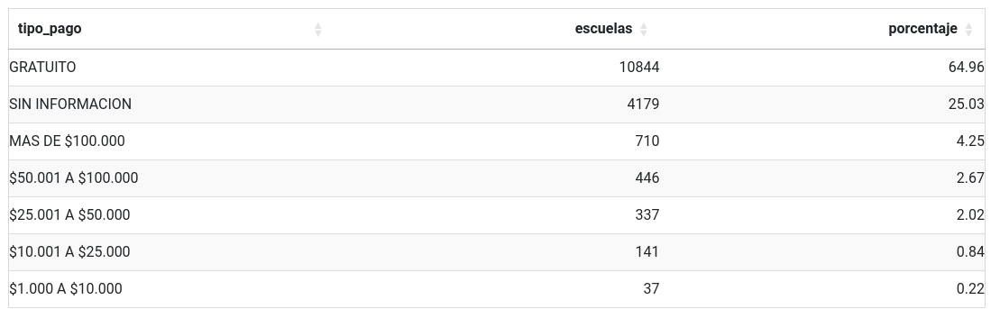
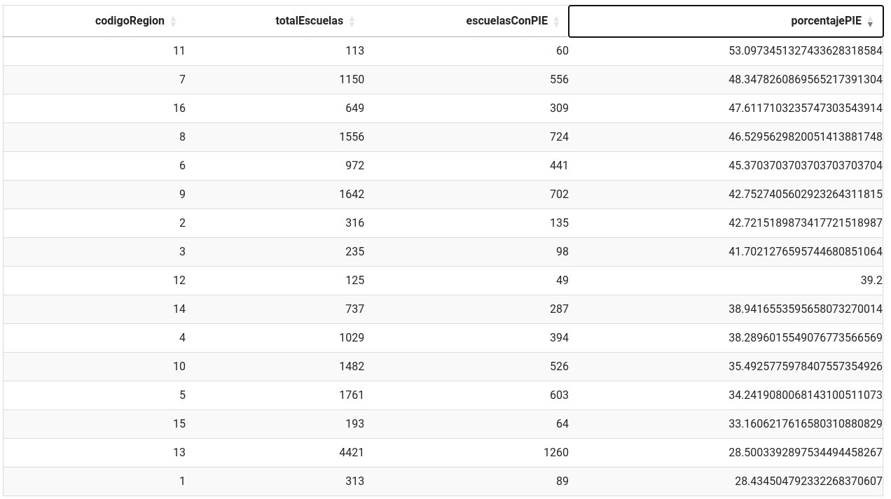
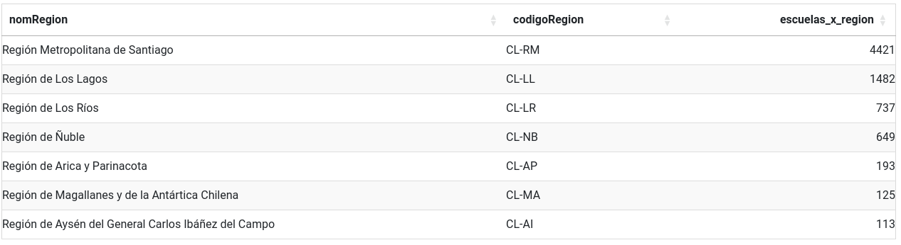

## Cantidad de establecimientos por tipo de pago
```
PREFIX mineduc: <https://datosabiertos.mineduc.cl/directorio-de-establecimientos-educacionales/>
PREFIX schema: <https://schema.org/>

SELECT ?tipo_pago ?escuelas ?porcentaje
WHERE {
  {
    SELECT (COUNT(?s) AS ?total) WHERE {?s a schema:School}
  }
  {
    SELECT ?tipo_pago (COUNT(?school) AS ?escuelas) 
    WHERE {
      ?school a schema:School .
      ?school mineduc:pago_mensual ?tipo_pago .
    } 
    GROUP BY ?tipo_pago 
  }
  BIND (ROUND(?escuelas / ?total * 100 * 100) / 100 AS ?porcentaje) 
} 
ORDER BY DESC(?escuelas)
```
### Respuesta


## Cantidad de establecimientos con Programa de Integración Especial (PIE) por región

```
PREFIX mineduc: <https://datosabiertos.mineduc.cl/directorio-de-establecimientos-educacionales/>
PREFIX schema: <https://schema.org/>


SELECT ?codigoRegion 
       (COUNT(?escuela) AS ?totalEscuelas) 
(SUM(IF(STR(?convenioPIE) = "1", 1, 0)) AS ?escuelasConPIE) 
((SUM(IF(STR(?convenioPIE) = "1", 1, 0)) / COUNT(?escuela)) * 100 AS ?porcentajePIE)
WHERE {
    ?escuela a schema:School ;
             mineduc:cod_reg_rbd ?codigoRegion ;
             mineduc:convenio_pie ?convenioPIE .
}
GROUP BY ?codigoRegion
ORDER BY DESC(?porcentajePIE)
```
### Respuesta


## Cantidad de escuelas por región (Federada)
Esta consulta utiliza Wikidata para entregar el nombre de la región basado en el número de la región que se encuentra en los datos.

```
PREFIX mineduc: <https://datosabiertos.mineduc.cl/directorio-de-establecimientos-educacionales/>
PREFIX schema: <https://schema.org/>
PREFIX wd: <http://www.wikidata.org/entity/>
PREFIX wdt: <http://www.wikidata.org/prop/direct/>
PREFIX rdfs: <http://www.w3.org/2000/01/rdf-schema#>


SELECT ?nomRegion ?codigoRegion ?escuelas_x_region
where {
  {
    SELECT ?region (COUNT(?school) AS ?escuelas_x_region)
    WHERE {
      ?school a schema:School .
      ?school mineduc:cod_reg_rbd ?region .
    } GROUP BY ?region ORDER BY DESC(?escuelas_x_region)
  }
  
  SERVICE <https://query.wikidata.org/sparql> {
    	?item wdt:P31 wd:Q590080 ;
          rdfs:label ?nomRegion ;
          wdt:P300 ?codigoRegion ;
    	  wdt:P6929 ?cut_code .
 
        FILTER(LANG(?nomRegion) = "es")            
  }
  
  FILTER(STR(?cut_code) = STR(?region))


}
```
### Respuesta
