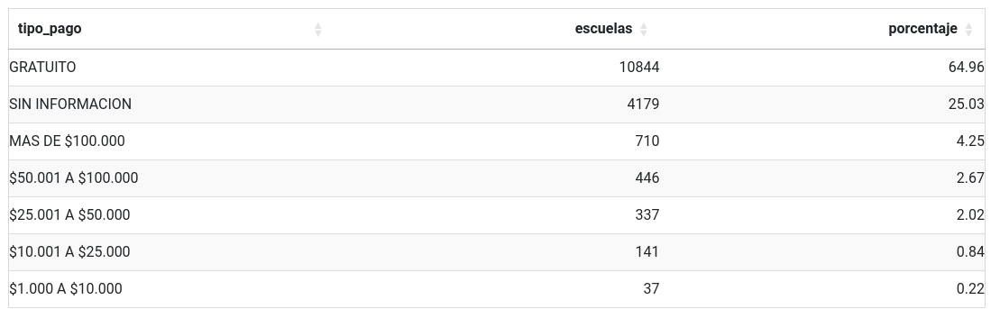
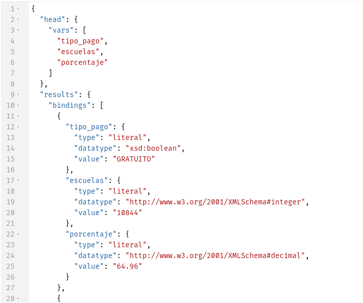
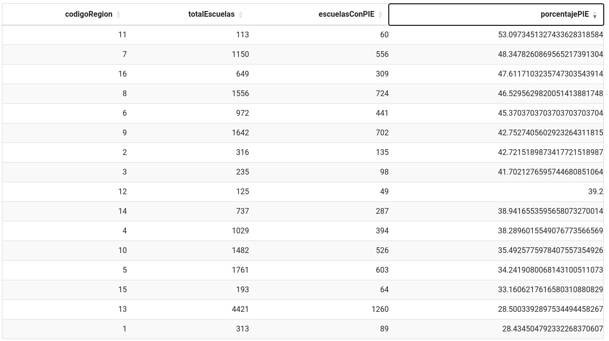
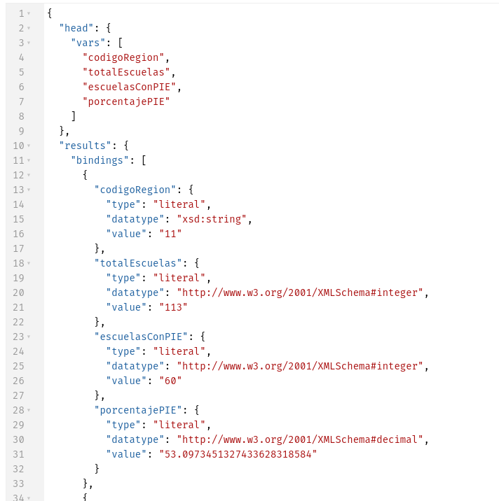
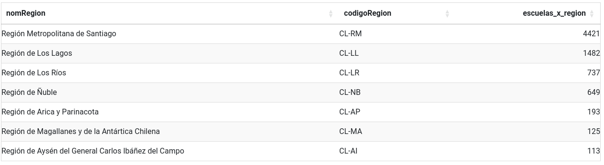
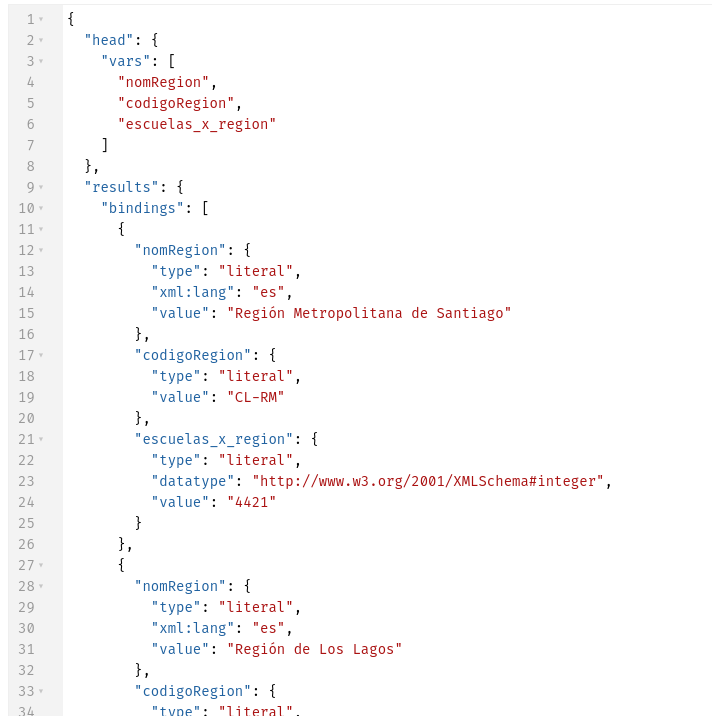

## Cantidad de establecimientos por tipo de pago
```
PREFIX mineduc: <https://datosabiertos.mineduc.cl/directorio-de-establecimientos-educacionales/>
PREFIX schema: <https://schema.org/>

SELECT ?tipo_pago ?escuelas ?porcentaje
WHERE {
  {
    SELECT (COUNT(?s) AS ?total) WHERE {?s a schema:School}
  }
  {
    SELECT ?tipo_pago (COUNT(?school) AS ?escuelas) 
    WHERE {
      ?school a schema:School .
      ?school mineduc:pago_mensual ?tipo_pago .
    } 
    GROUP BY ?tipo_pago 
  }
  BIND (ROUND(?escuelas / ?total * 100 * 100) / 100 AS ?porcentaje) 
} 
ORDER BY DESC(?escuelas)
```
### Respuesta en Apache-Fuseki


### Llamada al Endpoint
```
http://localhost:3030/mineduc_directorio/?query=PREFIX%20mineduc%3A%20%3Chttps%3A%2F%2Fdatosabiertos.mineduc.cl%2Fdirectorio-de-establecimientos-educacionales%2F%3E%0APREFIX%20schema%3A%20%3Chttps%3A%2F%2Fschema.org%2F%3E%0A%0ASELECT%20%3Ftipo_pago%20%3Fescuelas%20%3Fporcentaje%0AWHERE%20%7B%0A%20%20%7B%0A%20%20%20%20SELECT%20%28COUNT%28%3Fs%29%20AS%20%3Ftotal%29%20WHERE%20%7B%3Fs%20a%20schema%3ASchool%7D%0A%20%20%7D%0A%20%20%7B%0A%20%20%20%20SELECT%20%3Ftipo_pago%20%28COUNT%28%3Fschool%29%20AS%20%3Fescuelas%29%20%0A%20%20%20%20WHERE%20%7B%0A%20%20%20%20%20%20%3Fschool%20a%20schema%3ASchool%20.%0A%20%20%20%20%20%20%3Fschool%20mineduc%3Apago_mensual%20%3Ftipo_pago%20.%0A%20%20%20%20%7D%20%0A%20%20%20%20GROUP%20BY%20%3Ftipo_pago%20%0A%20%20%7D%0A%20%20BIND%20%28ROUND%28%3Fescuelas%20%2F%20%3Ftotal%20%2A%20100%20%2A%20100%29%20%2F%20100%20AS%20%3Fporcentaje%29%20%0A%7D%20%0AORDER%20BY%20DESC%28%3Fescuelas%29
```

### Respuesta del Endpoint



## Cantidad de establecimientos con Programa de Integración Especial (PIE) por región

```
PREFIX mineduc: <https://datosabiertos.mineduc.cl/directorio-de-establecimientos-educacionales/>
PREFIX schema: <https://schema.org/>


SELECT ?codigoRegion 
       (COUNT(?escuela) AS ?totalEscuelas) 
(SUM(IF(STR(?convenioPIE) = "1", 1, 0)) AS ?escuelasConPIE) 
((SUM(IF(STR(?convenioPIE) = "1", 1, 0)) / COUNT(?escuela)) * 100 AS ?porcentajePIE)
WHERE {
    ?escuela a schema:School ;
             mineduc:cod_reg_rbd ?codigoRegion ;
             mineduc:convenio_pie ?convenioPIE .
}
GROUP BY ?codigoRegion
ORDER BY DESC(?porcentajePIE)
```
### Respuesta Apache-Fuseki


### Llamada al Endpoint
```
http://localhost:3030/mineduc_directorio/?query=PREFIX%20mineduc%3A%20%3Chttps%3A%2F%2Fdatosabiertos.mineduc.cl%2Fdirectorio-de-establecimientos-educacionales%2F%3E%0APREFIX%20schema%3A%20%3Chttps%3A%2F%2Fschema.org%2F%3E%0A%0A%0ASELECT%20%3FcodigoRegion%20%0A%20%20%20%20%20%20%20%28COUNT%28%3Fescuela%29%20AS%20%3FtotalEscuelas%29%20%0A%28SUM%28IF%28STR%28%3FconvenioPIE%29%20%3D%20%221%22%2C%201%2C%200%29%29%20AS%20%3FescuelasConPIE%29%20%0A%28%28SUM%28IF%28STR%28%3FconvenioPIE%29%20%3D%20%221%22%2C%201%2C%200%29%29%20%2F%20COUNT%28%3Fescuela%29%29%20%2A%20100%20AS%20%3FporcentajePIE%29%0AWHERE%20%7B%0A%20%20%20%20%3Fescuela%20a%20schema%3ASchool%20%3B%0A%20%20%20%20%20%20%20%20%20%20%20%20%20mineduc%3Acod_reg_rbd%20%3FcodigoRegion%20%3B%0A%20%20%20%20%20%20%20%20%20%20%20%20%20mineduc%3Aconvenio_pie%20%3FconvenioPIE%20.%0A%7D%0AGROUP%20BY%20%3FcodigoRegion%0AORDER%20BY%20DESC%28%3FporcentajePIE%29
```

### Respuesta del Endpoint


## Cantidad de escuelas por región (Federada)
> [!NOTE]
> Esta consulta utiliza Wikidata para entregar el nombre y código de la región basado en el número de la región que se encuentra en los datos.
```
PREFIX mineduc: <https://datosabiertos.mineduc.cl/directorio-de-establecimientos-educacionales/>
PREFIX schema: <https://schema.org/>
PREFIX wd: <http://www.wikidata.org/entity/>
PREFIX wdt: <http://www.wikidata.org/prop/direct/>
PREFIX rdfs: <http://www.w3.org/2000/01/rdf-schema#>


SELECT ?nomRegion ?codigoRegion ?escuelas_x_region
where {
  {
    SELECT ?region (COUNT(?school) AS ?escuelas_x_region)
    WHERE {
      ?school a schema:School .
      ?school mineduc:cod_reg_rbd ?region .
    } GROUP BY ?region ORDER BY DESC(?escuelas_x_region)
  }
  
  SERVICE <https://query.wikidata.org/sparql> {
    	?item wdt:P31 wd:Q590080 ;
          rdfs:label ?nomRegion ;
          wdt:P300 ?codigoRegion ;
    	  wdt:P6929 ?cut_code .
 
        FILTER(LANG(?nomRegion) = "es")            
  }
  
  FILTER(STR(?cut_code) = STR(?region))


}
```
### Respuesta Apache-Fuseki


### Llamada al Endpoint
```
http://localhost:3030/#/dataset/mineduc_directorio/query?query=PREFIX%20mineduc%3A%20%3Chttps%3A%2F%2Fdatosabiertos.mineduc.cl%2Fdirectorio-de-establecimientos-educacionales%2F%3E%0APREFIX%20schema%3A%20%3Chttps%3A%2F%2Fschema.org%2F%3E%0APREFIX%20wd%3A%20%3Chttp%3A%2F%2Fwww.wikidata.org%2Fentity%2F%3E%0APREFIX%20wdt%3A%20%3Chttp%3A%2F%2Fwww.wikidata.org%2Fprop%2Fdirect%2F%3E%0APREFIX%20rdfs%3A%20%3Chttp%3A%2F%2Fwww.w3.org%2F2000%2F01%2Frdf-schema%23%3E%0A%0A%0ASELECT%20%3FnomRegion%20%3FcodigoRegion%20%3Fescuelas_x_region%0Awhere%20%7B%0A%20%20%7B%0A%20%20%20%20SELECT%20%3Fregion%20%28COUNT%28%3Fschool%29%20AS%20%3Fescuelas_x_region%29%0A%20%20%20%20WHERE%20%7B%0A%20%20%20%20%20%20%3Fschool%20a%20schema%3ASchool%20.%0A%20%20%20%20%20%20%3Fschool%20mineduc%3Acod_reg_rbd%20%3Fregion%20.%0A%20%20%20%20%7D%20GROUP%20BY%20%3Fregion%20ORDER%20BY%20DESC%28%3Fescuelas_x_region%29%0A%20%20%7D%0A%20%20%0A%20%20SERVICE%20%3Chttps%3A%2F%2Fquery.wikidata.org%2Fsparql%3E%20%7B%0A%20%20%20%20%09%3Fitem%20wdt%3AP31%20wd%3AQ590080%20%3B%0A%20%20%20%20%20%20%20%20%20%20rdfs%3Alabel%20%3FnomRegion%20%3B%0A%20%20%20%20%20%20%20%20%20%20wdt%3AP300%20%3FcodigoRegion%20%3B%0A%20%20%20%20%09%20%20wdt%3AP6929%20%3Fcut_code%20.%0A%20%0A%20%20%20%20%20%20%20%20FILTER%28LANG%28%3FnomRegion%29%20%3D%20%22es%22%29%20%20%20%20%20%20%20%20%20%20%20%20%0A%20%20%7D%0A%20%20%0A%20%20FILTER%28STR%28%3Fcut_code%29%20%3D%20STR%28%3Fregion%29%29%0A%0A%0A%7D
```

### Respuesta del Endpoint
