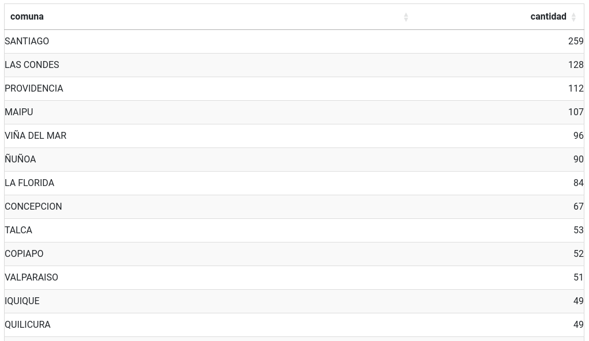
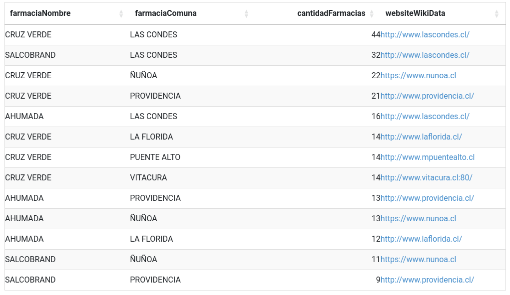

## Cantidad de farmacias por comuna
```
PREFIX ex: <https://midas.minsal.cl/>
PREFIX schema: <https://schema.org/>


  SELECT ?comuna (COUNT(?farmacia) AS ?cantidad)
  WHERE {
    ?farmacia a schema:Pharmacy ;
              ex:comuna ?comuna .
  }
GROUP BY ?comuna
ORDER BY DESC(?cantidad)
```
### Respuesta


## Cantidad de farmacias por comuna, agrupadas por nombre de farmacia, agregando la URL del sitio web de la comuna (consulta Federada)
> [!NOTE]
> Esta consulta utiliza Wikidata para obtener el listado de todas las comunas de Chile y la url de sus sitios web, y luego se cruza con la información del Ministerio de Salud
```
PPREFIX ex: <https://midas.minsal.cl/>
PREFIX schema: <https://schema.org/>
PREFIX wd: <http://www.wikidata.org/entity/>
PREFIX wdt: <http://www.wikidata.org/prop/direct/>
PREFIX rdfs: <http://www.w3.org/2000/01/rdf-schema#>


SELECT ?farmaciaNombre ?farmaciaComuna ?cantidadFarmacias ?websiteWikiData 
WHERE {
  {
    SELECT DISTINCT ?farmaciaNombre ?farmaciaComuna (COUNT(?pharmacy) AS ?cantidadFarmacias)
    WHERE {
      ?pharmacy a schema:Pharmacy ;
                schema:name ?farmaciaNombre ;
                ex:comuna ?farmaciaComuna .
    }
    GROUP BY ?farmaciaNombre ?farmaciaComuna
    ORDER BY DESC(?cantidadFarmacias)
    LIMIT 20
  }


  # Consulta federada a Wikidata para cada nombre de farmacia
  SERVICE <https://query.wikidata.org/sparql> {
    	?item wdt:P31 wd:Q1840161 ;
          rdfs:label ?itemLabel ;
          wdt:P856 ?websiteWikiData .
  
        FILTER(LANG(?itemLabel) = "es")      # Filtrar las etiquetas en español
        BIND(LCASE(?itemLabel) AS ?litemLabel) 
    }
  
  BIND(LCASE(?farmaciaComuna) AS ?lfarmaciacomuna)
  FILTER(STR(?litemLabel) = STR(?lfarmaciacomuna))
}

```
### Respuesta

