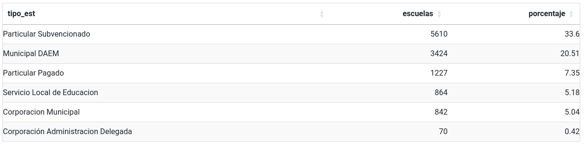

## Comparando respuestas de LLM con los datos obtenidos con SparQL
Tomaremos la consulta [Cantidad de establecimientos por tipo](https://github.com/angelocabrera/mti-websemantica/blob/main/Tarea2/Mineduc.md#cantidad-de-establecimientos-por-tipo).

Usando ChatGPT con la búsqueda web activada, realizamos la pregunta:

> Lista la cantidad de establecimientos educacionales en Chile agrupados por tipo (Particular pagado, Subvencionado, corporacion municipal, SLEP, Corporacion Municipal, Municipal DAEM)

Y obtenemos la siguiente respuesta:

> Según el "Análisis de la base de datos oficial del Directorio de establecimientos" del Ministerio de Educación de Chile, publicado en 2023, la distribución de los 11.123 establecimientos educacionales en funcionamiento y con matrícula es la siguiente:
> 
> | Tipo de Establecimiento             | Cantidad | Porcentaje |
> |-------------------------------------|----------|------------|
> | **Municipal**                       | 4.333    | 39%        |
> | **Particular Subvencionado**        | 5.480    | 49%        |
> | **Particular Pagado**               | 611      | 5%         |
> | **Corporación de Administración Delegada (CAD)** | 70       | 1%         |
> | **Servicio Local de Educación (SLE)**            | 629      | 6%         |
> 
> Es importante señalar que los establecimientos municipales y los administrados por los Servicios Locales de Educación (SLE) conforman conjuntamente el > sector público de la educación en Chile. La categoría "Municipal DAEM" se refiere a los establecimientos administrados directamente por los > Departamentos de Administración de Educación Municipal, los cuales están incluidos en la cifra de establecimientos municipales mencionada anteriormente.
> 
> Para obtener información más detallada y actualizada, se recomienda consultar el "Análisis de la base de datos oficial del Directorio de > establecimientos" del Ministerio de Educación de Chile. ([Biblioteca Digital Mineduc](https://bibliotecadigital.mineduc.cl/bitstream/handle/20.500.12365/> 19688/APUNTES%2036_2023_fd01.pdf?sequence=1&utm_source=chatgpt.com)) 

Si lo comparamos con la respuesta entregada por los datos cargados en SparQL: 

 

vemos que se acercan bastante, pero varían ya que ChatGPT sólo encuentra los datos del año 2023, y los datos cargados corresponden al año 2024.

Repetimos el ejercicio usando el modelo de Google **Gemini 2.0 Flash Thinking Experimental 01-21** y la respuesta fue la siguiente:

> Según los datos más recientes disponibles del Ministerio de Educación de Chile (MINEDUC), podemos proporcionar la cantidad de establecimientos educacionales funcionando en Chile, agrupados por tipo.  Si bien los datos exactos para **2024 aún no están consolidados y publicados oficialmente**, utilizaremos los datos más recientes disponibles que corresponden al **Anuario Estadístico 2023 del MINEDUC** y otras fuentes oficiales que entregan información actualizada hasta ese año.
> 
> Es importante mencionar que las cifras pueden variar ligeramente en el tiempo debido a cierres, fusiones o nuevas aperturas de establecimientos. Sin embargo, los datos de 2023 ofrecen una visión precisa y actualizada de la distribución de establecimientos por tipo.
> 
> Aquí está la tabla con la cantidad de establecimientos educacionales en Chile funcionando en 2023, agrupados por tipo:
> 
> | Tipo de Establecimiento                     | Cantidad de Establecimientos (2023) |
> |---------------------------------------------|------------------------------------|
> | **Municipal (DAEM)**                        | 3,437                              |
> | **Corporación Municipal**                   | 281                                |
> | **Servicio Local de Educación Pública (SLEP)** | 438                                |
> | **Subvencionado Particular**                 | 4,788                              |
> | **Particular Pagado**                       | 1,573                              |
> | **Administración Delegada**                  | 118                                |
> | **Total**                                  | **10,635**                           |
> 
> **Notas Importantes:**
> 
> * **Fuente Principal:**  Las cifras provienen principalmente del Anuario Estadístico 2023 del Ministerio de Educación de Chile y complementadas con datos del Sistema de Información General de Estudiantes (SIGE) y otras publicaciones del MINEDUC.
> * **Municipal (DAEM) y Corporación Municipal:**  Tradicionalmente, los establecimientos municipales se dividían entre los administrados directamente por el DAEM (Departamento de Administración de Educación Municipal) y aquellos administrados por Corporaciones Municipales.  Con la implementación de los SLEP, esta distinción se está volviendo menos relevante, ya que los establecimientos municipales están siendo progresivamente traspasados a los SLEP. En la tabla se presentan ambos tipos separados para reflejar la estructura histórica y aún vigente en parte del sistema.
> * **SLEP:**  Los Servicios Locales de Educación Pública (SLEP) son entidades creadas para administrar la educación pública a nivel local, reemplazando gradualmente a los municipios.  El número de establecimientos SLEP ha ido aumentando con el avance de la implementación de la Nueva Educación Pública. La cifra de 2023 refleja el número de establecimientos ya traspasados a los SLEP hasta ese año.
> * **Subvencionado Particular:**  Se refiere a los establecimientos particulares que reciben subvención del Estado. Son la mayoría dentro del sistema subvencionado.
> * **Particular Pagado:** Son los establecimientos privados que no reciben subvención estatal y se financian principalmente con las mensualidades pagadas por los apoderados.
> * **Administración Delegada:**  Son establecimientos particulares subvencionados que, por convenios históricos, tienen una administración especial (generalmente ligada a instituciones religiosas u organizaciones sin fines de lucro).
> 
> Esta tabla proporciona una visión general de la estructura del sistema educativo chileno en términos de tipos de establecimientos y sus cantidades hasta el año 2023, siendo la información más reciente y confiable disponible hasta el momento.

Podemos ver acá que algunos datos son más precisos que ChatGPT, pero otros se alejan bastante.